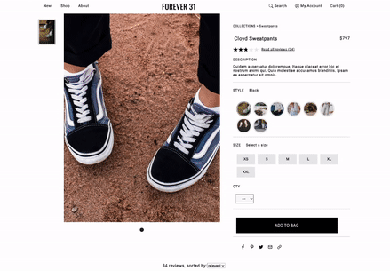

# Forever 31

Front end design of an online clothing retailer's website



## Product Details


## Questions & Answers


## Product Reviews


<!-- TABLE OF CONTENTS -->
<details open="open">
  <summary>Table of Contents</summary>
  <ol>
    <li>
      <a href="#getting-started">Getting Started</a>
      <ul>
        <li><a href="#dependencies">Dependencies</a></li>
        <li><a href="#installation">Installation</a></li>
        <li><a href="#executing-program">Executing program</a></li>
      </ul>
    </li>
    <li><a href="#help">Help</a></li>
    <li><a href="#authors">Authors</a></li>
    <li><a href="#version-history">Version History</a></li>
    <li><a href="#license">License</a></li>
    <li><a href="#acknowledgements">Acknowledgements</a></li>
  </ol>
</details>


## Getting Started

### Dependencies

* Describe any prerequisites, libraries, OS version, etc., needed before installing program.
* ex. Windows 10

### Installation

* Source: https://github.com/Quadratic-Quokkas/FEC-135/
* Any modifications needed to be made to files/folders

### Executing program

* How to run the program
* Step-by-step bullets
```
code blocks for commands
```

## Help

Any advise for common problems or issues.
```
command to run if program contains helper info
```

## Authors

Sean Claybaugh<br>
Iris Jiang<br>
Elizabeth Phung

## Version History

* 0.2
    * Various bug fixes and optimizations
    * See [commit change]() or See [release history]()
* 0.1
    * Initial Release

## License

This project is licensed under the [NAME HERE] License - see the LICENSE.md file for details

## Acknowledgments

Inspiration, code snippets, etc.
* [](https://)
* [](https://)
* [](https://)
* [](https://)
* [](https://)
