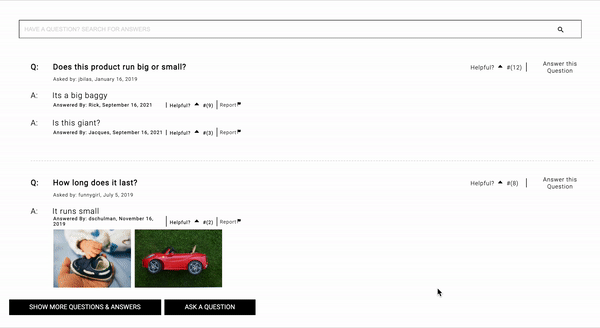

<h1 align="center">Forever 31 </h1>


<p align="center"> 

</p>


<h3 align="center">Product Details</h3>

<p align="center"> 

</p>

<h3 align="center">Questions & Answers</h3>

<p align="center"> 

</p>

<p align="center"> 

</p>

<h3 align="center">Product Reviews</h3>

<p align="center"> 

</p>


<!-- TABLE OF CONTENTS -->
<details open="open">
  <summary>Table of Contents</summary>
  <ol>
    <li>
      <a href="#getting-started">Getting Started</a>
      <ul>
        <li><a href="#dependencies">Dependencies</a></li>
        <li><a href="#installation">Installation</a></li>
        <li><a href="#executing-program">Executing program</a></li>
      </ul>
    </li>
    <li><a href="#help">Help</a></li>
    <li><a href="#authors">Authors</a></li>
    <li><a href="#version-history">Version History</a></li>
    <li><a href="#license">License</a></li>
    <li><a href="#acknowledgements">Acknowledgements</a></li>
  </ol>
</details>


## Getting Started


### Installation

* Source: https://github.com/Quadratic-Quokkas/FEC-135/
* Any modifications needed to be made to files/folders

### Executing program

* How to run the program
* Step-by-step bullets
```
code blocks for commands
```

## Help

Any advise for common problems or issues.
```
command to run if program contains helper info
```

## Authors

Iris Jiang<br>
Elizabeth Phung<br>
Sean Claybaugh<br>


## Version History

* 0.2
    * Various bug fixes and optimizations
    * See [commit change]() or See [release history]()
* 0.1
    * Initial Release


## Acknowledgments

Inspiration, code snippets, etc.
* [](https://)
* [](https://)
* [](https://)
* [](https://)
* [](https://)
